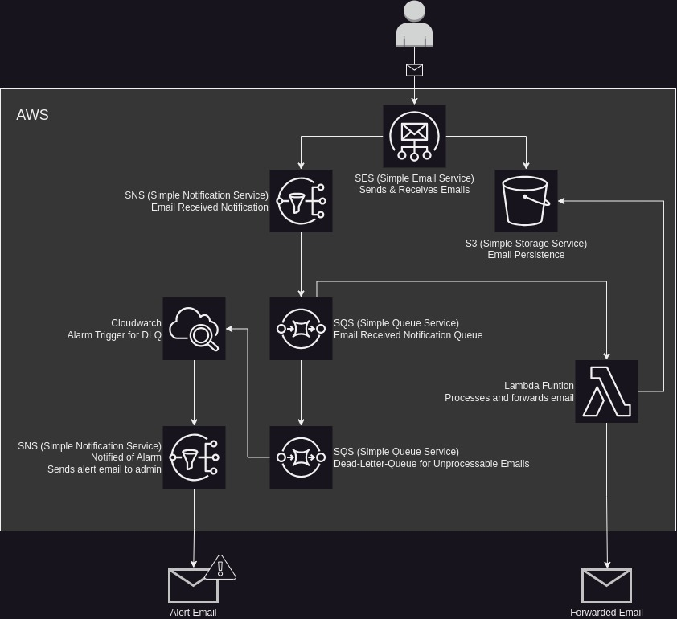

# Email-Forwarder
Do you have a domain you're managing through AWS? Would you like to use that domain for emails, but you're too cheap to pay the $4.00 a month per user for WorkMail? Then I may have the product for you. This project aims to forward emails sent to your domain to an address of your choosing for as many users as you want!

### Features
 * *Multiple Mappings:* Maybe you'd like to forward emails for more than yourself. With multiple email mappings, you can forward emails for the entire family!
 * *Reply To Sender:* Forwarded emails aren't sent to your target inbox by the sender, they are sent by the forwarding process. Replys to emails, though, are still sent to the orginal sender.
 * *Unmapped Emails Bounced*: Emails sent to an address that isn't mapped gets bounced back to the sender! This will let them know their email was not recived by anyone.
 * *Original Message Headers:* Knowing who sent the email, and who the email was intended for, is important. This forwarder adds the orginal header info to the body of the email, including the orginal `From`, `To`, and `Cc` headers.
 * *Supports Large Attachments:* Large or small, you'll get your attachments! (Up to 40MB, see Limitations)

### Limitations
  * *No Spoofing*: Ideally, the emails you receive in your target inbox would have all of the original headers, like it was sent directly to that address, but this isn't possible in SES. AWS requires emails sent through SES be a verified address or domain.
  * *40 MB Limit*: SES supports emails only up to 40MB.

# Infrastructure

